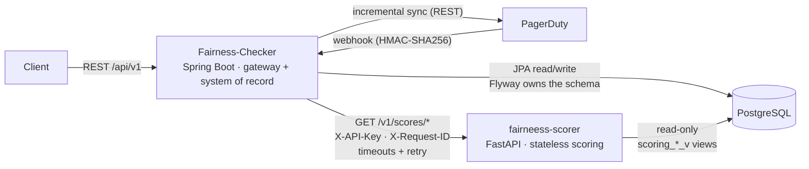
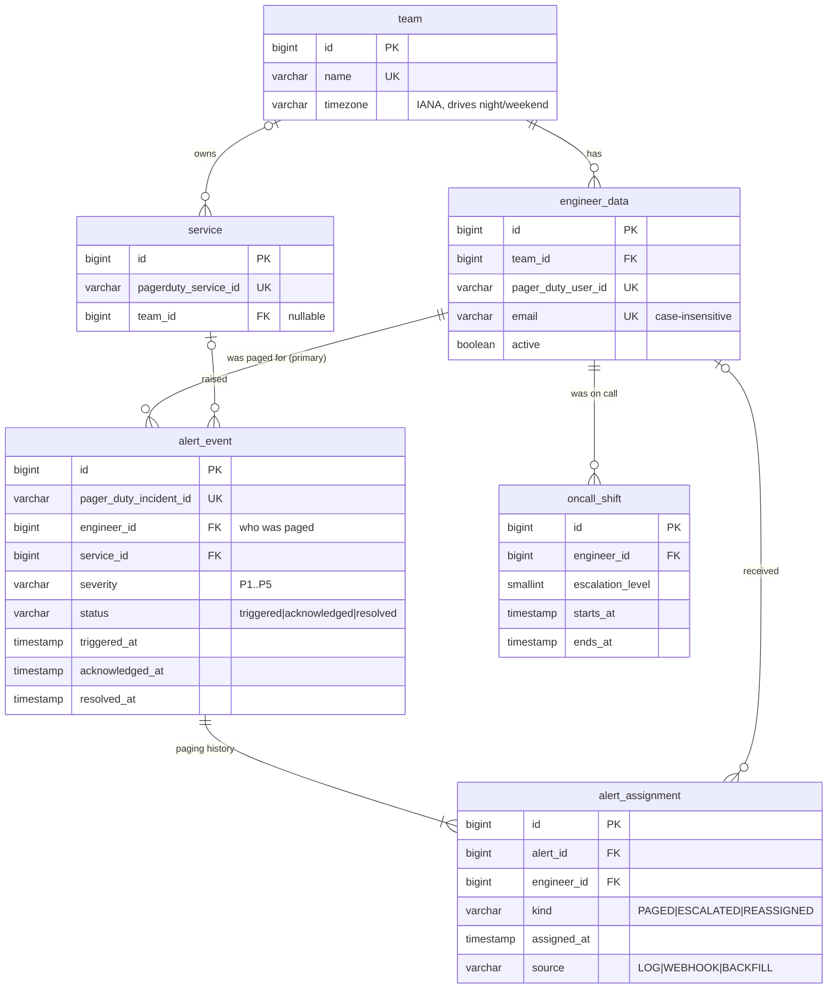

# Architecture

On-call fairness and burnout tracker for PagerDuty. Two services share one PostgreSQL database with a
strict ownership split.

## Responsibilities

| Concern | Fairness-Checker (Java) | fairneess-scorer (Python) |
|---|---|---|
| Role | Public gateway, ingestion, system of record | Internal, stateless computation |
| Database | Owns every table; the only writer | Reads two views only |
| Schema changes | Flyway migrations in `src/main/resources/db/migration`; Hibernate only validates | None |
| Exposure | Public (Azure App Service) | Private network only, API key required |

## Data model

Conventions:
- **Event times** (`triggered_at`, `starts_at`, …) are `timestamp` in **UTC**, as PagerDuty reports them.
  **Audit columns** `created_at`/`updated_at` are `timestamptz`, filled by the database (default + trigger), so
  every writer gets them without application code.
- **Integrity lives in the database:** foreign keys, `CHECK` constraints for enums and time ordering, unique
  keys that make every sync idempotent. The application validates too, but the database is the last line.
- **`alert_event.engineer_id`** is the primary (first-paged) engineer, kept on the row for fast scoring;
  `alert_assignment` holds the full history, rebuilt from the PagerDuty incident log when an incident
  changes. The incident log is the source of truth; webhook rows are provisional until the next sync.
- **Engineers are deactivated, not deleted,** once they have history.

## Contracts

**Database contract: the `scoring_*_v` views** (`scoring_engineer_v`, `scoring_alert_v`,
`scoring_assignment_v`, `scoring_oncall_v`; created in V2 and extended in V3). The scorer never reads tables
directly. Tables can be refactored freely as long as the views keep their columns; views may gain columns
(appended, via `CREATE OR REPLACE VIEW`), but renaming or removing one is a breaking change and needs a
coordinated release. View timestamps are UTC unless the column name ends in `_local` (the engineer's team
timezone).

**HTTP contract: scorer `/v1/scores/*`.** Versioned in the path. Pydantic models on the scorer side and Java
records in `dto/scoring` describe the same JSON; a breaking change means a new `/v2` path, not an edit to `/v1`.
Every call carries:
- `X-API-Key`, a shared secret (`SCORER_API_KEY`), compared in constant time.
- `X-Request-ID`, generated by the gateway per incoming request and written to both services' logs, so one
  user request can be traced across services.

## Data flow

1. **Ingestion.** PagerDuty pushes webhooks (verified with HMAC-SHA256). A scheduled sync pulls incidents
   created in the last `PAGERDUTY_SYNC_LOOKBACK_DAYS` days as a safety net for missed webhooks, upserting by
   PagerDuty incident id (unique index).
2. **On-call shifts.** The same scheduled job reads PagerDuty `/oncalls` (in ≤ 90-day chunks) into
   `oncall_shift`, merging overlapping pieces of one shift.
3. **Attribution.** An alert belongs to the engineer who was **paged**: the first assignee, falling back to
   the incident's first assignment log entry. It is set once on creation and never overwritten by later
   updates, so resolving someone else's incident doesn't move the alert to you.
   The incident log (read when an incident is new or changes status) rebuilds the alert's paging history
   (`alert_assignment`: paged, escalated, reassigned) and sets `acknowledged_at`.
4. **Scoring.** The gateway forwards score requests to the scorer, which loads the window from the views
   (cached for 60 s), computes scores in pandas and returns typed JSON. Scoring rules are in
   `fairneess-scorer/docs/SCORING.md`.

## Reliability

| Failure | Behaviour |
|---|---|
| Scorer slow | Connect timeout 2 s, response timeout 10 s → gateway returns 504 |
| Scorer down / 5xx | GET retried twice with exponential backoff (200 ms base) → then 503 |
| Scorer 4xx | Passed through (e.g. 404 unknown engineer), never retried |
| PagerDuty slow | Same timeouts on the PagerDuty client; a failed sync is logged and retried next cycle |
| Database down | Scorer readiness (`/health`) and gateway readiness (`/actuator/health/readiness`) fail; compose / the platform stops routing traffic |

## Security

- Secrets only come from the environment (`.env` locally, App Service settings in Azure); `.env` files are
  git-ignored and excluded from Docker images.
- Scorer: API key on all `/v1` routes; health and metrics are unauthenticated and must stay on the private
  network. Error responses never include database details.
- Database: the scorer should log in as a read-only role limited to the two views
  (`ops/sql/create_scorer_readonly_role.sql`).
- Webhooks: HMAC-SHA256 with constant-time comparison.
- **Open item:** the gateway's own `/api/**` routes have no authentication yet. Put them behind Microsoft
  Entra ID (OAuth2 resource server) or at minimum an API gateway before exposing write routes publicly.

## Observability

| | Gateway | Scorer |
|---|---|---|
| Logs | Structured JSON (`LOGGING_STRUCTURED_FORMAT_CONSOLE=ecs`) with `requestId` | JSON (`LOG_FORMAT=json`) with `request_id`, method, path, status, duration |
| Metrics | `/actuator/prometheus` | `/metrics` |
| Health | `/actuator/health/liveness`, `/actuator/health/readiness` | `/health/live`, `/health` |

## Delivery

- **CI:** each repo runs its own pipeline on pull requests. Java: `mvn verify`, including a Testcontainers
  test that applies every Flyway migration to a real PostgreSQL and validates the JPA mapping. Python: ruff,
  mypy, unit tests and integration tests against a PostgreSQL service container.
- **CD:** a merge to `main` in Fairness-Checker deploys the JAR to Azure App Service. Flyway runs pending
  migrations at startup. The scorer image is built by CI and is not deployed automatically yet.
- **Local (Docker):** each repo has its own `docker-compose.yml` and runs independently. They share the external
  Docker network `fairness-net` (`docker network create fairness-net`, once per machine), where the gateway
  reaches the scorer at `http://scorer:8000`. Neither compose file runs a database: both connect to the
  existing PostgreSQL from their `.env`. The scorer port is bound to `127.0.0.1` only.

## Configuration

New settings introduced with this architecture (existing database and PagerDuty settings are unchanged):

| Variable | Service | Required | Default | Purpose |
|---|---|---|---|---|
| `SCORER_API_KEY` | both | **yes** (≥ 32 chars, same value on both) | none | Gateway → scorer authentication |
| `PYTHON_SCORER_URL` | gateway | in Azure | `http://127.0.0.1:8000` | Where the scorer runs |
| `SCORER_CONNECT_TIMEOUT` / `SCORER_RESPONSE_TIMEOUT` / `SCORER_MAX_RETRIES` | gateway | no | `2s` / `10s` / `2` | Scorer call resilience |
| `PAGERDUTY_CONNECT_TIMEOUT` / `PAGERDUTY_RESPONSE_TIMEOUT` | gateway | no | `5s` / `30s` | PagerDuty call timeouts |
| `PAGERDUTY_SYNC_ENABLED` / `PAGERDUTY_SYNC_LOOKBACK_DAYS` | gateway | no | `true` / `30` | Scheduled incident sync |
| `PAGERDUTY_ONCALL_LOOKBACK_DAYS` | gateway | no | `7` | Scheduled on-call sync; backfill with `POST /api/pagerduty/sync/oncalls?days=365` |
| `SEED_DEMO_DATA` | gateway | no | `false` | Demo engineers in an empty database |
| `JPA_SHOW_SQL` | gateway | no | `false` | Log SQL (debugging only) |
| `LOGGING_STRUCTURED_FORMAT_CONSOLE` | gateway | no | plain text | `ecs` for JSON logs |
| `TEAM_TIMEZONE` / `CACHE_TTL_SECONDS` | scorer | no | `Asia/Kolkata` / `60` | Timezone for `start`/`end` dates (night/weekend use each team's own timezone); result cache |
| `LOG_FORMAT` / `LOG_LEVEL` | scorer | no | `text` (`json` in Docker) / `INFO` | Logging |

## Known limitations

- Single gateway instance assumed: the scheduled sync has no distributed lock (add ShedLock before scaling out).
- The scorer loads the full window into memory; fine up to ~10⁵ alerts per window. Beyond that, move
  aggregation into SQL.
